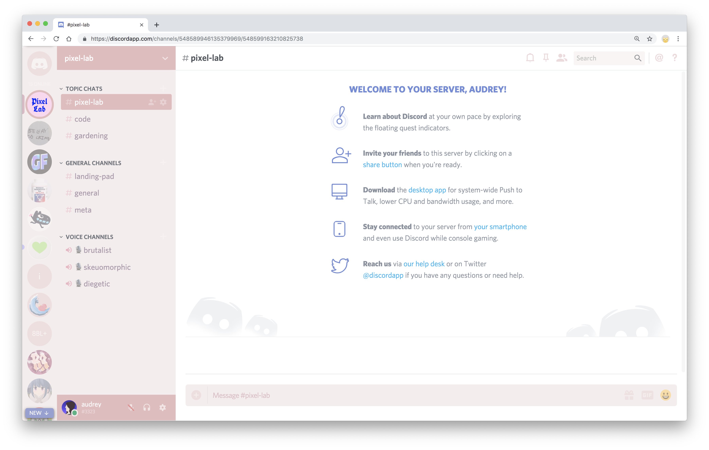

# \~ soft era \~

## **color scheme for [Discord](https://discordapp.com/)**

🌸 Light pastel syntax theme for soft, warm, cozy, cute chatting. 🌱

**notes:**

- must be using Discord in a browser
- browser must have a CSS override extension like [Stylus](https://add0n.com/stylus.html)
- _soft era_ currently only has a bright theme, so these overrides only work when Discord is set to Light appearance (dark mode to come)

\~.\~
 &nbsp;&nbsp;a soft, warm, low contrast theme,
 &nbsp;&nbsp;with pastel accents that are easy on your eyes

^.^
 &nbsp;&nbsp;make stuff and learn.
 &nbsp;&nbsp;make the world your kinda place.
 &nbsp;&nbsp;take care of the people around you

🌿

## Installation

- use Discord in your browser of choice
- in that browser, install a browser extension like [Stylus](https://add0n.com/stylus.html)
- add a new ruleset for discord.com
- copy all content inside of `soft-era-discord.css` (file in this repo)
- paste all of that into your CSS override rules.
